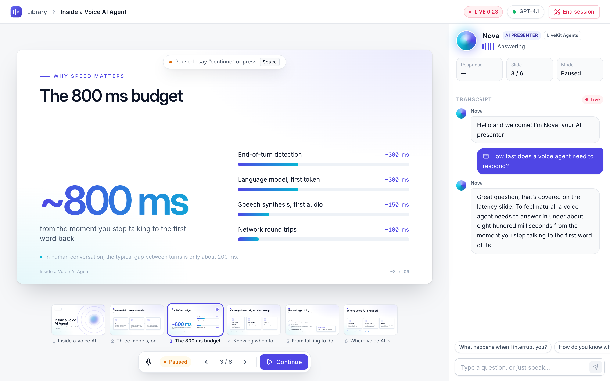
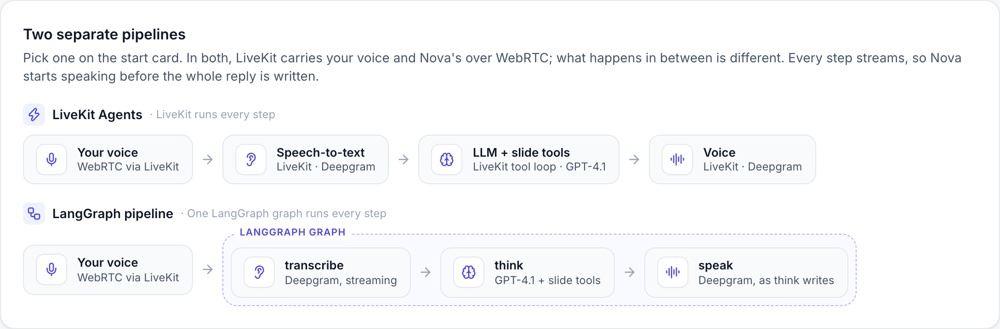
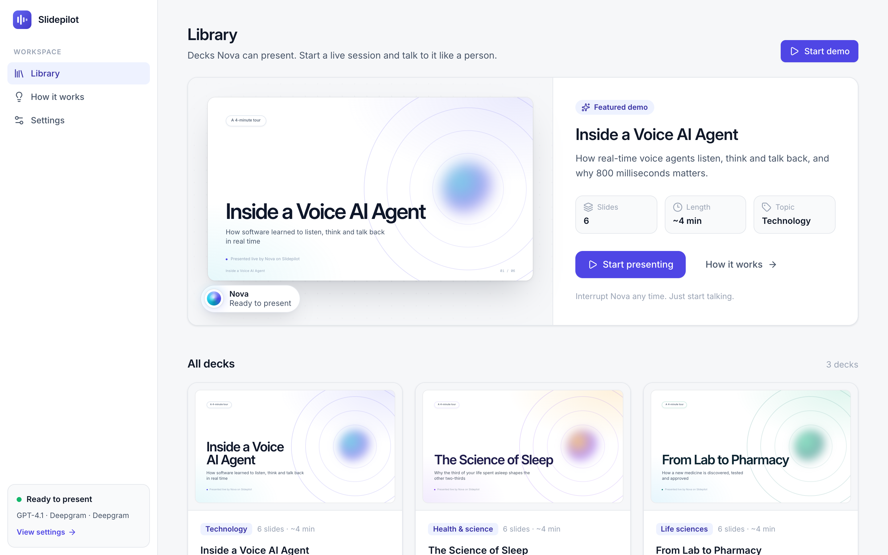
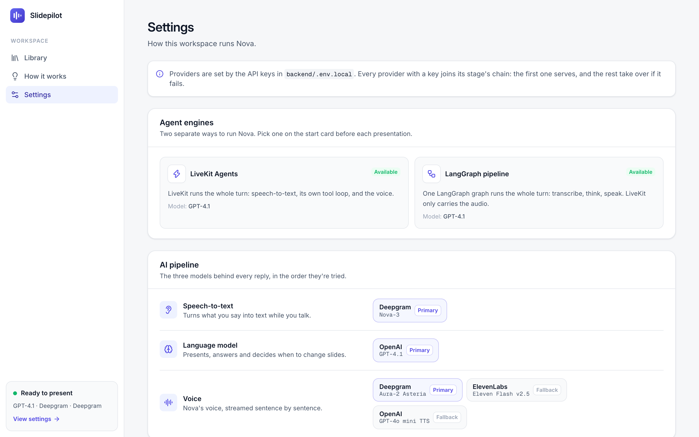

# Slidepilot: presentations that talk back

Slidepilot is a voice AI presenter. Pick a deck and **Nova** presents it out loud, slide by slide. Talk over it whenever you like: Nova stops mid-sentence, listens, and if another slide answers your question, **jumps to that slide** to answer. Say "continue" and it picks up where it left off.

> **Pick the agent you want to test.** Slidepilot has two separate agent pipelines, and you choose one before each session under *Agent engine* on the start card:
>
> - **LiveKit Agents** (default): LiveKit runs the whole turn: streaming speech-to-text, its built-in tool-calling loop, and the voice.
> - **LangGraph pipeline**: one LangGraph graph runs the whole turn: **transcribe** (Deepgram) → **think** (a LangGraph agent) → **speak** (Deepgram Aura).
>
> In both, LiveKit carries the audio between the browser and the server. Both present the same decks with the same features, so you can run the same session on each and compare. See [how they differ](#two-agent-engines-pick-one-per-session).

Built with **LiveKit Agents**, **LangGraph**, **React** and **FastAPI**.



## Architecture

Every session runs on one of two separate agent engines, and **the user picks which one** on the start card: **LiveKit Agents** or **LangGraph pipeline**. LiveKit carries the audio for both, and the rest of the architecture is shared.

```
 Browser: React app                                  API: FastAPI (backend/app/server.py)
 ┌──────────────────────────────┐ POST /api/sessions ┌─────────────────────────────────────┐
 │ Library · live room          │ deck + engine ───▶ │ Room token, plus a dispatch of      │
 │ Start card: you pick LiveKit │ ◀── URL + token    │ the agent with the deck and the     │
 │ Agents or LangGraph pipeline │                    │ chosen engine in its metadata       │
 │                              │                    └─────────────────────────────────────┘
 │ Slides, captions, controls   │
 └───────────────┬──────────────┘
                 │ WebRTC: your voice, Nova's voice, captions,
                 │ the presenter's state, slide clicks
                 ▼
 ┌──────────────────────────────┐   joins the room   ┌─────────────────────────────────────┐
 │ LiveKit room                 │ ◀────────────────  │ Agent worker (backend/app/agent.py) │
 │ local server or LiveKit Cloud│                    │                                     │
 └──────────────────────────────┘                    │ Runs the engine the user picked:    │
                                                     │ • LiveKit Agents, all in LiveKit:   │
                                                     │   STT ▶ LiveKit tool loop ▶ TTS     │
                                                     │ • LangGraph pipeline, one graph:    │
                                                     │   transcribe ▶ think ▶ speak        │
                                                     │                                     │
                                                     │ Presenter: guided run, 4 tools,     │
                                                     │ state for the browser               │
                                                     └─────────────────────────────────────┘
```

- **Browser** (`frontend/`): a React app. It shows the slides, live captions and controls, and has the **Agent engine** picker on the start card.
- **API** (`backend/app/server.py`): FastAPI. It serves the decks and creates a LiveKit room token for each session. The token dispatches the agent with the chosen deck and engine.
- **Agent worker** (`backend/app/agent.py`): joins the room and runs the voice pipeline. It runs whichever engine the user picked. With LiveKit Agents, LiveKit's `AgentSession` does the speech-to-text (Deepgram, streaming), the LLM turn and the voice (Deepgram Aura, with fallbacks). With the LangGraph pipeline, one LangGraph graph does all three (`voice_pipeline.py`), and LiveKit only plays the audio it makes. The presenter (`presenter.py`) runs the guided presentation and the slide tools, and publishes the state the browser renders.
- **LiveKit**: carries audio, captions, state and controls between the browser and the agent. Use a local `livekit-server` or LiveKit Cloud.

## Two agent engines: pick one per session

Both engines use the same prompts, slide tools, presentation state and UI, so you can test the same presentation on each one. They are two separate pipelines: nothing in the speech-to-text → agent → voice path is shared.

```
LiveKit Agents:      you ─▶ [ LiveKit: speech-to-text ─▶ tool loop + GPT-4.1 ─▶ voice ] ─▶ you
LangGraph pipeline:  you ─▶ [ LangGraph graph: transcribe ─▶ think + GPT-4.1 ─▶ speak ] ─▶ you
                     (in both, LiveKit carries the audio between the browser and the agent over WebRTC)
```



**To choose:** open a deck, pick **LiveKit Agents** or **LangGraph pipeline** under *Agent engine* on the start card, then press **Start presentation**. The presenter panel shows which engine is live, and the choice is remembered for next time. The LangGraph pipeline needs `OPENAI_API_KEY` and `DEEPGRAM_API_KEY`; without them, the option is disabled.

| | LiveKit Agents (default) | LangGraph pipeline |
|---|---|---|
| Speech-to-text | LiveKit, streaming (Deepgram) | Deepgram, streaming: one stream for the session, and the graph's `transcribe` node takes each utterance's transcript when you stop |
| The agent's turn | LiveKit's built-in tool loop, with `@function_tool` methods on the presenter | The graph's `think` node: a LangGraph agent with LangChain tools in a `ToolNode` |
| Voice | LiveKit, streaming (Deepgram Aura, with fallbacks) | The graph's `speak` node (Deepgram Aura, with fallbacks), sentence by sentence while `think` is still writing; LiveKit plays the audio and captions it |
| Detecting turns and interruptions | LiveKit: a turn detector and voice activity detection | The pipeline's own voice activity detection, which stops LiveKit's playback |
| Model | The LLM fallback chain from *Run it locally* | The configured OpenAI model (GPT-4.1 by default) through `langchain-openai` |
| Starts replying early | Yes: preemptive generation starts while you finish your sentence | Partly: it transcribes while you talk, and voices the first sentence while the rest is still being written |
| Response time, one test (spoken question with a slide jump / goodbye) | 2.7 s / 2.1 s on LiveKit Cloud | 2.8 s / 2.7 s on a local server |

The LangGraph pipeline, in `backend/app/voice_pipeline.py`:

```
START ─┬─▶ transcribe ─┬─▶ think ──▶ END   the person spoke
       │               └─▶ speak ──▶ END
       └─────────────────▶ think + speak   the app asked for a narration
```

- `transcribe` takes what the person said from the session's one Deepgram stream, which hears every word as it's spoken (with the deck's keyterms). Usually the transcript is final by the time they stop; otherwise it asks Deepgram to finalize the last words.
- `think` runs the LangGraph agent below with GPT-4.1, so narrations, answers, slide jumps, "continue" and goodbyes behave as on the LiveKit engine. It hands the reply to `speak` word by word as it writes it.
- `speak` runs alongside `think` in the same graph step. It voices each sentence as soon as it's complete and streams the audio out of the graph. LiveKit plays it with `session.say()`, which also captions it.
- Around the graph, `VoicePipeline` listens to the person's microphone with LiveKit's bundled voice activity detector. It cuts Nova off once the person has talked over it for 0.4 s and speech-to-text has heard words, so a cough, background noise or Nova's own echo doesn't. It runs the graph after 0.6 s of silence, and the presentation doesn't go back to where it stopped until the answer has finished playing. Typed questions skip `transcribe`. The LiveKit session itself has no speech-to-text, LLM, voice or voice activity detection of its own.
- The first version waited for each step to finish before starting the next, and took 4 to 6 s per reply: about 2.5 s uploading the whole utterance to Deepgram, and 2 s for the agent to write its whole answer. Streaming between the steps brought it to 2.7 to 3 s in live tests, on par with the LiveKit engine. The agent log breaks down every reply, for example `replied in 2.8 s (transcribe 0.6 s, first words 0.9 s, first audio 1.2 s)`, where the 0.6 s is the silence that marks the end of the person's turn.

The `think` step, in `backend/app/langgraph_agent.py`:

```
START ─┬─▶ narrate ──────────────────▶ END   the app asked for a slide's narration
       └─▶ converse ─┬───────────────▶ END   the person spoke; nothing to change
             ▲       └─▶ tools ─┬────▶ END   slide shown after the answer, or the
             │                  │            session ending after the goodbye
             └──────────────────┘            otherwise give (or continue) the answer
```

- `narrate` has no tools bound, so a slide's narration can't wander off to another slide.
- `converse` has all four tools. After `tools`, the graph ends in two cases: the only call was `show_slide` and the answer was already spoken, or the only call was `end_session` and the goodbye was already said. These are the same no-follow-up rules the LiveKit engine follows. Otherwise it loops back for the follow-up reply.
- Only what the nodes mean to say ends up in the reply, never tool results.

The engine travels with the session. The browser sends it to `POST /api/sessions`, the API puts it in the agent's dispatch metadata, and the agent builds that engine. Without the keys the LangGraph pipeline needs, the API refuses it.

## Run it locally

**You need:** [uv](https://docs.astral.sh/uv/) (it installs Python 3.12 for you), Node.js 20+, a LiveKit server, and API keys for the speech and language models.

```bash
brew install livekit                          # local LiveKit server; or use a free LiveKit Cloud project
cp backend/.env.example backend/.env.local    # add your keys (see below)
make setup                                    # uv sync + npm install
make dev                                      # LiveKit, API on :8000, agent worker, web app on :5173
```

Open **http://localhost:5173**, pick a deck, choose the agent engine and press **Start presentation**.

| Stage | Providers, in order of preference |
|---|---|
| Speech-to-text | `DEEPGRAM_API_KEY` (Deepgram Nova-3) |
| LLM | `ANTHROPIC_API_KEY` (Claude Opus 5.5) → `OPENAI_API_KEY` (GPT-4.1) → `GOOGLE_API_KEY` (Gemini 2.5 Flash) |
| Voice | `DEEPGRAM_API_KEY` (Deepgram Aura) → `ELEVEN_API_KEY` (ElevenLabs, voice from `ELEVEN_VOICE_ID`) → `OPENAI_API_KEY` (OpenAI TTS) |

Every provider with a key joins a **fallback chain**. The first one serves, and if it fails (an exhausted free tier, an outage, a rejected key) the session moves to the next one instead of going silent.

A Deepgram key plus any one LLM key is enough. The cheapest complete setup is a Deepgram key, which covers both hearing and voice, plus a free [Gemini key](https://aistudio.google.com/apikey). On ElevenLabs' free plan, the API only serves the default voices; Voice Library voices need a paid plan.

The LangGraph pipeline needs `OPENAI_API_KEY` and `DEEPGRAM_API_KEY`.

`make dev` starts the local LiveKit server when `LIVEKIT_URL` points at localhost. To see each log on its own, run `make livekit`, `make api`, `make agent` and `make web` in separate terminals. The agent prints a notice that `dev` mode is deprecated in favour of `lk agent dev`; the notice is harmless.

**On LiveKit Cloud instead:** put your project's URL and keys in `.env.local`. Any stage without its own key then runs on LiveKit Inference, which also backs up the providers you do have keys for, and Nova uses LiveKit's cloud turn detector. On a local server it uses the turn-detector model bundled with the SDK.

When a session ends, `livekit` 1.1.20 releases a few native handles twice: the room releases its audio sources, and Python drops them again as they're garbage-collected ([livekit/python-sdks#845](https://github.com/livekit/python-sdks/issues/845)). This is harmless, but each double drop printed a warning and an `AssertionError` traceback. `backend/app/agent.py` filters out exactly that noise; remove the filter once the SDK is fixed.

## Try it in two minutes

1. Open **Inside a Voice AI Agent**, pick an agent engine (**LiveKit Agents** or **LangGraph pipeline**) and press **Start presentation**.
2. Let Nova present. The slide changes exactly when the narration for the previous one ends.
3. Interrupt mid-sentence: *"Wait, how fast does a voice agent need to respond?"* Nova stops, jumps to the latency slide and answers.
4. Then stay quiet. Right after answering, Nova says something like *"I hope that answers your question. Now, back to where I left off"* and picks up the slide it was presenting, not the one it jumped to. Ask a follow-up instead and it answers that first.
5. Click any thumbnail (or use ← →) and Nova follows. Type a question in the box if you'd rather not speak. **Space** pauses and continues.
6. Say *"Bye bye"*: Nova says goodbye and closes the session. (**End session** works too.) The summary shows the duration, slides seen and questions asked, with a transcript download.
7. Press **Present again**, switch to the other engine, and repeat.

Headphones give the cleanest interruptions. LiveKit also ignores barge-in for the first few seconds of a session while echo cancellation warms up.

## How it meets the brief

| Requirement | How Slidepilot does it |
|---|---|
| Present 5–6 slides on a topic | Three 6-slide decks: "Inside a Voice AI Agent", "The Science of Sleep" and "From Lab to Pharmacy", on how a new medicine is discovered, tested and approved. Nova narrates each slide and moves to the next one on its own. |
| Change slides based on the user's question | The LLM has the whole deck plus speaker notes, and a `show_slide` tool. A question about another slide's content moves the slide, then gets answered. Works on both engines. |
| User can interrupt the agent | LiveKit turn handling: voice activity detection plus a turn detector. Barge-in stops the audio within a fraction of a second and pauses the guided run. After answering, Nova goes back to where it stopped by itself. |
| Lightweight frontend and backend | React + Vite + Tailwind web app; FastAPI for decks and session tokens; a LiveKit agent worker for the voice pipeline. |

| Library | Settings |
|---|---|
|  |  |

## How it works

The agent owns the presentation state. The browser renders it and sends intents:

| Channel | Direction | Used for |
|---|---|---|
| `slidepilot.state` participant attribute | agent → browser | slide on screen, mode (`presenting` / `paused` / `finished`), why it changed, sequence number, engine |
| `slidepilot.latency_ms` participant attribute | agent → browser | measured response time, shown in the presenter panel |
| RPC `slidepilot.goto` / `slidepilot.pause` / `slidepilot.resume` | browser → agent | thumbnail clicks, arrow keys, Pause / Continue |
| `lk.chat` text stream | browser → agent | typed questions |
| `lk.transcription` text streams | agent → browser | live captions for both sides, synced to the audio |

### Design decisions

- **Code drives the guided run; the LLM drives Q&A.** Each slide's narration is its own reply. When that reply finishes playing without being interrupted, the next slide goes up and the next reply starts. Slide changes therefore land exactly between narrations, and nothing depends on the model remembering to call a `next_slide` tool. The LLM gets four tools:
  - `show_slide`: show the slide that answers a question. Nova gives the whole answer, opening with a bridge ("Good question, that's on the latency slide"), and calls the tool in the same response. The slide changes mid-answer, and the code skips the usual follow-up LLM call because the answer was already spoken, so a jump costs one LLM round trip, not two.
  - `resume_presentation`: no arguments, so the model can't guess a slide. It picks up exactly where the guided run was interrupted.
  - `present_from_slide`: for "skip to the slide about tools" or "start over". It presents that slide and carries on from there.
  - `end_session`: for "bye" or "that's all for today". Nova says goodbye in the same response. Once the goodbye has played, the agent tells the browser, which closes the session and shows the summary. If the person cuts in during the goodbye, the session stays open. "Stop" or "wait" only pauses.
- **A reminder next to each question.** When the person speaks, a one-line reminder is added beside their message. It names the slide on screen and the tool rules. In testing with GPT-4.1, this made slide changes consistent where the system prompt alone had not.
- **"Continue" returns to a bookmark.** The guided run remembers where it was. If a question jumped from slide 2 to slide 5, "continue" resumes slide 2. If narration was cut off mid-slide, Nova is told to pick up where it left off rather than restart the slide; LiveKit keeps only the words you actually heard in its history.
- **Every interruption pauses the run, and the run continues by itself after the answer.** That covers speaking, typing, and noise that stops the audio. Nova never talks over a question. Once it has answered and the person has been quiet for 0.6 s, it says it's going back and picks up the slide it stopped on. A follow-up question is answered first, whether it starts in that pause or cuts into the pick-up. The Pause button (or Space) holds the run until the person continues. Clicking a slide mid-presentation is different: the run moves to that slide and keeps going. While paused, Nova gives a short overview of the clicked slide instead.
- **State, not events.** The agent publishes its state as a participant attribute, so a browser that reconnects gets the current slide immediately. Writes are serialized and always carry the latest state. A sequence number lets the UI tell a fresh jump, which gets a toast, from a repeated update.
- **Speech recognition knows the deck's vocabulary.** Each deck lists the jargon people are likely to say (`keyterms` in its JSON: "VAD", "STT", "barge-in", "REM", "adenosine"). The agent passes that list, plus Nova's name, to Deepgram Nova-3 through LiveKit's `stt_context_options`. On 16 synthetic clips across four voices, including an Indian English one, "VAD" was transcribed correctly 14 times with the keyterms and 9 times without. Without them it came out as "that", "Matt" or "Vaad". The system prompt also tells the LLM to expect misheard jargon, so "What does bad do in a voice agent?" gets an answer about VAD.
- **Tool calls written out as text are caught.** Now and then GPT-4.1 writes the call it means to make into its spoken reply ("…pick up from there. present_from_slide 5", or "calling show_slide(slide_number=2)") instead of making it. In testing that happened in about one reply in eight that should have changed slides, both in LiveKit's tool loop and in the LangGraph agent. Spoken, it's gibberish, and the slide never changes. Every reply streams through a filter (`backend/app/spoken.py`) that holds back anything that could be the start of a tool name, for one token at most. The filter keeps the call out of the voice and the transcript, and makes the call instead. After the fix, none of 84 test turns against GPT-4.1, through either of them, spoke a tool call.
- **No "let me show you that slide" at the end.** The slide changes as soon as Nova starts answering, but GPT-4.1 likes to announce a tool call just before making it, so 6 of 8 test answers ended with "Let me show you that slide now". Telling it not to didn't help. The same filter now holds back a closing sentence like that and drops it if the answer ends there; in a retest, 0 of 8 did. If the announcement is followed by more of the answer, or is the whole reply (a bridge while the answer is fetched), it's spoken.
- **Split questions show as one line.** Speech-to-text can cut one question in two at a pause; the transcript joins consecutive lines from the person.
- **Speaker notes are private.** Each slide has notes that the presenter uses for depth when presenting and answering. The API strips them before sending decks to the browser.

## Models and configuration

All selection logic is in `backend/app/models.py`. The provider table under *Run it locally* sets the LiveKit engine's LLM chain. The LangGraph pipeline uses the configured OpenAI model, GPT-4.1 by default. Override any choice in `backend/.env.local` with `SLIDEPILOT_{STT,LLM,TTS}_PROVIDER`, `SLIDEPILOT_{STT,LLM,TTS}_MODEL` and `SLIDEPILOT_TTS_VOICE`; the full list is in `backend/.env.example`.

Turn handling waits 0.6 s after you stop speaking before committing a turn, slightly longer than LiveKit's 0.3 s default. In testing, Deepgram's final transcript arrived about 0.5 s after speech ended, and the shorter delay split one question into two messages. When the turn detector thinks you may not be finished, it waits at most 1.5 s. On LiveKit Cloud the default is 2.5 s, which it used up on "Wait. How fast does a voice agent need to respond?".

Barge-in uses voice activity detection, locally and on Cloud. In testing, LiveKit Cloud's adaptive interruption took 1.1 s to notice someone talking over Nova, then timed out and switched itself off mid-session.

Measured on the LiveKit engine with GPT-4.1, Deepgram and a spoken question, Nova's first word comes 2 to 3 s after you stop talking, including when it changes slides. Most of that is the LLM's first token (about 1 s) and the turn detector. The presenter panel shows the measured value for every answer, and the agent log has a breakdown for each reply: `replied in 2.7 s (first LLM token 0.9 s, first sentence to the voice 1.9 s, first audio 0.3 s)`.

If a provider fails for good (a rejected key or an account out of credits, for example), the agent reports it and the browser shows a toast saying what went wrong, instead of Nova going quiet.

Claude runs through LiveKit's Anthropic plugin with a few additions:

- `effort: low`, because spoken replies are short and time-to-first-word matters more than depth (`SLIDEPILOT_LLM_EFFORT` changes it).
- A higher `max_tokens`, so thinking doesn't cut replies short.
- Anthropic's server-side refusal fallback. If a safety classifier declines a request, it is retried on Anthropic's recommended fallback model instead of leaving Nova silent.

## Tests

```bash
make test   # backend tests + frontend type check and lint
```

- **Backend:** 73 tests. They cover:
  - the deck schema (including that every deck's theme and icons exist in the web app), prompts, provider selection, fallback chains and error messages;
  - the presentation state machine;
  - the session token and its agent dispatch, including the engine choice;
  - the LangGraph agent's routing;
  - the LangGraph pipeline (transcribe → think and speak side by side) with stand-in speech services, including a transcript that's ready the moment the person stops and last words that still need finalizing, and the presenter running on it through an interruption, a slide jump, "continue", continuing by itself after an answer, the rest of the deck, and a goodbye that ends the session;
  - the tool-call filter, run against the leaks GPT-4.1 actually produced, streamed in random pieces;
  - the presenter on a real LiveKit `AgentSession` with a scripted LLM, on the LiveKit Agents engine. These runs exercise auto-advance, interruption, a question that jumps slides (including the one-round-trip answer), resuming from the bookmark, clicking a slide mid-narration, a tool call written into the reply, a goodbye that ends the session, and continuing by itself after an answer while Pause holds.
  - the speech-recognition keyterms, and the filter that hides only the known SDK shutdown noise.

## Project layout

```
backend/
  app/
    agent.py            LiveKit worker entrypoint: session, browser controls, latency metric
    presenter.py        The presenter agent: guided run, slide tools, per-turn reminder
    langgraph_agent.py  The LangGraph agent: the pipeline's think step, as a state graph
    voice_pipeline.py   The LangGraph pipeline engine: transcribe → think → speak in one graph
    spoken.py           Keeps tool calls the model writes as text out of the speech, and makes them
    presentation.py     Pure presentation state (bookmark, progress), unit-tested on its own
    prompts.py          System instructions and per-step prompts built from the deck
    models.py           STT / LLM / TTS / turn-handling selection and the Claude wrapper
    server.py           FastAPI: decks, session tokens, serves the built web app
    decks.py            Deck schema and loader
  decks/*.json          Decks: 6 slides each, with speaker notes
  tests/
frontend/src/
  pages/                Library, How it works, Settings, and the live room
  components/           Slide renderer (6 layouts), agent orb, controls, transcript
  lib/                  API client, LiveKit session hook, transcript, formatting
```

## Adding a deck

Drop a JSON file into `backend/decks/` with 5–6 slides. The available layouts are `cover`, `steps`, `stat`, `cards`, `bullets` and `closing`; the existing decks show the shape. List the deck's acronyms and jargon under `keyterms`, so speech recognition listens for them. Restart the API and the deck appears in the library. Nova learns the slides and their speaker notes automatically.

## Deploying

Slidepilot runs locally by default. To put it online:

- Use a LiveKit Cloud project (it has a free tier). Set `LIVEKIT_URL`, `LIVEKIT_API_KEY`, `LIVEKIT_API_SECRET` and the provider keys in the environment of both processes below.
- **Agent:** from `backend/`, run `uv run python -m app.agent download-files` once, then `uv run python -m app.agent start` on any server. It only makes outgoing connections.
- **Web + API:** `make build`, then from `backend/` run `uv run uvicorn app.server:app --host 0.0.0.0 --port 8000`. The API serves the built web app on the same origin. Serve it over HTTPS: browsers only allow the microphone on secure pages.

## What I'd build next

- Upload a PDF or Word document and get a deck back. An LLM writes the slides, speaker notes and keyterms in the same JSON schema using structured outputs. It runs as a background job, and the deck appears in the library when it's ready.
- A fallback model for the LangGraph pipeline (LangChain's `with_fallbacks`), and LangGraph's checkpointer to remember a person across sessions.
- Accounts, saved sessions, and per-session analytics, such as which slides prompt the most questions.
- Multilingual decks (multilingual STT and turn detection), plus a video avatar for Nova.
